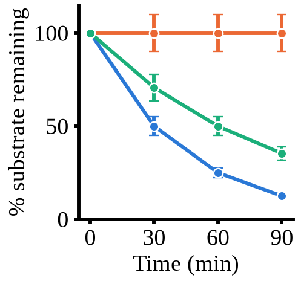

# chxchasechart

Turn ImageJ measurements of a cycloheximide chase into a normalized decay plot.

`chx_chase.py` takes two ImageJ Results tables — one for the protein of interest,
one for the PGK1 loading control — normalizes each band to its loading control
and then to the first time point, averages replicates, and draws a
publication-sized figure.

Band measurement stays in ImageJ. This script starts from the exported table.

## Requirements

Python 3.10+ with `numpy`, `pandas`, `matplotlib`.

```bash
pip install numpy pandas matplotlib
```

## Quick start

The repository ships a worked example in `example/`: three conditions × four
time points × **three biological replicates**, with a measured PGK1 control and
a background table.

```bash
python chx_chase.py example/raw.csv example/pgk1_control.csv 3 -r 3 --background example/background.tsv
```



The example is idealized, so the curves land on exact half-lives:

| Curve | Condition | Half-life | 0 min | 30 min | 60 min | 90 min |
|---|---|---|---|---|---|---|
| **blue** | WT | 30 min | 100 % | 50 % | 25 % | 12.5 % |
| **orange** | stabilized mutant | none | 100 % | 100 % | 100 % | 100 % |
| **green** | intermediate mutant | 60 min | 100 % | 70.7 % | 50 % | 35.4 % |

Replicates carry a 10 % coefficient of variation, so each error bar is 10 % of
its value. Curves are drawn in the palette's fixed order — condition 1 blue,
2 orange, 3 green — so adding `--legend-loc "lower left"` and
`--names WT stabilized intermediate` labels them without changing any color.

The simplest possible call takes every default — four time points, one
replicate, 0/30/60/90 min, no background:

```bash
python chx_chase.py raw.csv pgk1_control.csv 4
```

## Preparing the input in ImageJ

1. Measure every band of the protein of interest into one Results table, and
   every band of the PGK1 control into a second one.
2. Measure them in the **same order** — the two tables are matched row by row.
3. The default row order is condition → time point → replicate, with condition
   varying slowest. Lanes loaded in another order are handled by `--order`.
4. Save each table (`File > Save As`) as `.csv` or `.tsv`.

The two tables must have the same number of rows, and that number must equal
conditions × time points × replicates. If it doesn't, the script says so and
names the numbers it expected.

### Table format

Comma- or tab-separated, with or without a header row. Headed ImageJ exports
(` ,Area,Mean,Min,Max`) are read by column name, so `--column Mean` or
`--column IntDen` picks whichever measurement you want.

A headerless table is assumed to end with ImageJ's default four measurements —
`Area`, `Mean`, `Min`, `Max` — with any leading columns treated as row number,
label or slice. Export with a header row if you measured something else.

### Background subtraction

Optional. `--background bg.tsv` takes a two-row table: row 1 is the background
for the raw measurement, row 2 for the PGK1 control. Each is subtracted from
every band of its own table before normalization.

```bash
python chx_chase.py example/raw.csv example/pgk1_control.csv 3 -r 3 --background example/background.tsv
```

The script refuses to continue if a control band drops to zero or below after
subtraction, and warns if a raw band does.

## What it calculates

For each band: divide by the matching loading-control band, then divide by the
first time point of that same condition **and replicate**. Every series
therefore starts at 100 %, and each replicate is normalized against its own zero
point before averaging.

Mean and SD (ddof = 1) are then taken across replicates. With `-r 1` there is
nothing to average, so the SD column is empty and no error bars are drawn — the
script says so rather than drawing a misleading zero.

## Outputs

A run with `-o chx_chase` writes:

| File | Contents |
|---|---|
| `chx_chase.png` | The figure |
| `chx_chase_summary.csv` | n, mean and SD per condition and time point, in percent |
| `chx_chase_per_replicate.csv` | Every band: signal, background, control, ratio, percent |

## Command reference

```
python chx_chase.py RAW CONTROL CONDITIONS [options]
```

**Experiment layout**

| Option | Default | Purpose |
|---|---|---|
| `-t, --timepoints` | `4` | Time points per condition |
| `-r, --replicates` | `1` | Replicates per condition |
| `--order` | `ctr` | Row order: `c`ondition, `t`ime, `r`eplicate; leftmost varies slowest |
| `-c, --column` | `Mean` | Measurement column to quantify |
| `-b, --background TSV` | none | Two-row background table (row 1 raw, row 2 control) |
| `--names` | `Condition 1…` | Condition names, in table order |
| `--times` | `0 30 60 90` | Time of each point (30 min steps by default) |
| `--time-unit` | `min` | Unit for `--times` |

**Figure**

| Option | Default | Purpose |
|---|---|---|
| `--figsize W H` | `3 3` | Size of the **plot area** in cm; labels sit outside it |
| `--font` | `Liberation Serif` | Font family; warns if not installed |
| `--fontsize` | `9` | Text size in pt |
| `--yticks` | `0 50 100` | Y ticks, in percent |
| `--ylabel` | `% substrate remaining` | Y-axis label |
| `--legend-loc` | `none` | `lower left`, `upper right`, … to add a legend |
| `--title` | none | Plot title |
| `-o, --out` | `chx_chase` | Output prefix |
| `--format` | `png` | `png`, `pdf` or `svg` |
| `--dpi` | `300` | Raster resolution |
| `--show` | off | Also open a window |

## Figure notes

`--figsize` sizes the **plot area**, not the file, because that is what decides
how a panel sits next to others in a figure. A 3 × 3 cm plot area produces a file
of about 4.3 × 4.3 cm once the axis labels are included.

Line width is 0.5 mm and markers are 1.5 mm across including their white outline.
These are the `LINE_WIDTH_MM`, `MARKER_SIZE_MM` and `MARKER_EDGE_MM` constants at
the top of `chx_chase.py`.

For LaTeX, `--format pdf` keeps the text as vector and embeds the font. Include
it at natural size (`\includegraphics{chx_chase.pdf}`, no `width=`) so the 9 pt
labels stay 9 pt.

## One thing to watch in the source data

On a blot imaged as **dark bands on a light background**, ImageJ's `Mean` gets
*lower* as the band gets stronger. Dividing a raw signal by such a control
corrects loading in the wrong direction.

If your two blots were imaged with opposite polarity — a chemiluminescence
capture for the protein and a stained membrane for the control, say — invert one
of them in ImageJ (`Edit > Invert`) before measuring, or measure both as
inverted-mean, so that both tables run in the same direction.

Also worth checking before quantifying: bands whose pixels hit the end of the
scale are clipped and read too low. Because clipping hits the strongest bands
hardest, it flattens early time points and makes degradation look slower than it
really is. The fix is a shorter exposure, not analysis.
